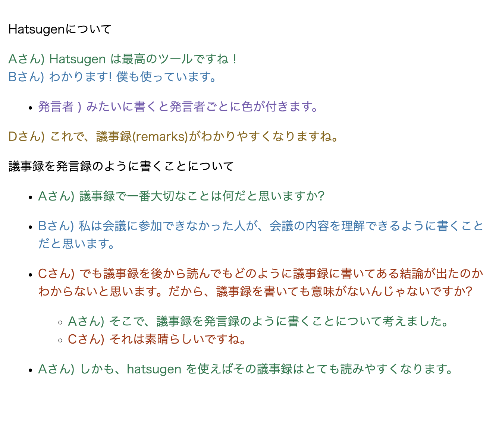

# Hatsugen

`hatsugen` is a javascript for highlight sentence in remarks with a html file.

`hatsugen` highlight sentence that start with `[NAME]) ` in html.

## Demo



[Live Demo](https://junseinagao.github.io/hatsugen/)

## Simple Usage

Load css and js in your html file.

```html
<link
  rel="stylesheet"
  href="https://unpkg.com/browse/hatsugen@0.0.1/dist/hatsugen.js"
/>
<script
  type="module"
  src="https://unpkg.com/browse/hatsugen@0.0.1/dist/css/default.css"
></script>
```

You can custom colorlize to custom stylesheet.

(`hatsugen` highlight your html through `data-hatsugen-id` attribute.)

```css
[data-hatsugen-id="1"] {
  color: red;
}
[data-hatsugen-id="2"] {
  color: blue;
}
```

## Author

[junseinagao](https://github.com/junseinagao)

## LICENSE

MIT

```

```
